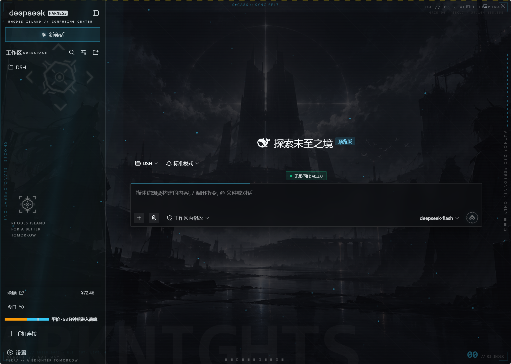

# Arknights-flavor-theme · 明日方舟主题皮肤



DeepSeek Harness Web GUI 的明日方舟（Arknights）主题皮肤：罗德岛 key visual 背景、青色 HUD、粒子与呼吸动效、原子思考图标。纯外观注入。

## 安装

**前提**：Windows、已安装 [Node.js](https://nodejs.org) 与 pnpm（`npm i -g pnpm`）、DSH Desktop 至少启动过一次（已生成 `~/.dsh`）。

### 方式 A：脚本一键安装（推荐）

```powershell
git clone https://github.com/lzhhhhc/Arknights-flavor-theme.git
cd Arknights-flavor-theme
powershell -ExecutionPolicy Bypass -File install-new-machine.ps1
```

脚本会自动：复制插件到 `~/.dsh/plugins/dsh-arknights-skin` → 注册 web / desktop 两个 Profile → `pnpm install`。完成后重启 DSH Desktop 即可。

### 方式 B：手动安装

1. 将仓库clone或下载到任意位置，把整个文件夹复制到 `~/.dsh/plugins/dsh-arknights-skin`
2. 编辑 `~/.dsh/profiles/web/package.json` 与 `~/.dsh/profiles/desktop/package.json`，在 `dependencies` 和 `dsh.profile.bundles` 中各加入一行：

   ```json
   "dependencies": {
     "@dsh-external/dsh-client-ui-skin-arknights": "file:../../plugins/dsh-arknights-skin"
   },
   "dsh": {
     "profile": {
       "bundles": [ "...", "@dsh-external/dsh-client-ui-skin-arknights" ]
     }
   }
   ```

3. 在两个 Profile 目录分别执行 `pnpm install`
4. 重启 DSH Desktop

> 本插件自包含：全部素材 base64 内嵌、零第三方依赖，无需安装任何其它插件。

## 卸载

1. 从两个 Profile 的 `package.json` 中移除 `@dsh-external/dsh-client-ui-skin-arknights`（dependencies 与 bundles 两处）
2. 在 Profile 目录执行 `pnpm install`
3. 删除 `~/.dsh/plugins/dsh-arknights-skin` 文件夹，重启 DSH Desktop

## 功能清单

- **调色板**：`--dsw-alias-*` + shadcn 变量双系统覆盖，暗色玻璃面板，背景图透出
- **粒子**：90 颗青色小光点，canvas 逐帧渲染，上浮+摇摆+闪烁；切后台暂停；reduced-motion 静态化
- **呼吸动效**：ARKNIGHTS 幽灵大字 / 四角 HUD 括号（错相）/ 青色几何块 / 核心徽章慢旋转
- **扫光**：9s 周期斜向青色高光掠过全屏（顶层）
- **HUD 装饰字符**：十六进制滚动读数（160ms）、左右缘竖排字、刻度条、右缘刻度列、网格坐标、十字准星、版本戳、TERRA 行、R.I. 徽标水印、logo 副标题、工作区 WORKSPACE 双语（900ms 扫描器维护注入）
- **发送按钮**：用户徽章图标化（无边框，hover 放大提亮）
- **输入卡**：细线边框 + 顶部青色强调线（聚焦拉伸至全宽）
- **深度思考图标**：出现「深度思考/思考中/思考完成」标签时自动替换为三轨道原子模型（电子沿轨道运动，2.6/3.6/4.4s 三速）

## 维护指南（DSH 升级后）

主题分三层，稳定性从高到低：

| 层 | 用到的挂点 | 升级兼容性 |
|---|---|---|
| 变量层 | `--dsw-alias-*`、shadcn `--background/--sidebar` 等官方主题变量 | 最稳：是 DSH 自己的换肤 API |
| 结构层 | `data-slot='sidebar'`、`[data-composer-card]`、`[data-cordis-panel]`、`button[class*='brand']` | 稳：官方插槽命名 |
| 类名层 | `[class*='_primary']`、`[class*='sidebarCol']`、`x-Wl6W_*` 等哈希/语义子串 | 半稳：UI 大重构时可能失效 |

**失效表现**：类名层失效 ≠ 插件崩溃，只是那一小块区域回到官方原样，客户端本身不受影响（本插件只注入样式与装饰 DOM，零功能逻辑）。

**升级 DSH 后的标准动作**：
1. 正常重启 DSH
2. 哪里「露白/露原样」，用 DevTools（`--remote-debugging-port=9222`）看那块的 class/data 属性
3. 在 `build.py` 对应段落补选择器 → `python build.py` → 两个 profile 跑 `pnpm install` → 重启

**与其它插件的兼容**：本插件不注册工具、不注入提示词、不碰会话数据，唯一注入依赖 `slots` 是 DSH 核心服务；与功能类插件（infinite-gen-4 等）零依赖关系，纯净版 DSH 亦可单独使用（已在全新出厂 Profile 实测：16 项全要素检查通过，插件页相关规则自动睡眠）。同类皮肤插件（都改 body 属性的）会互相覆盖，二选一。

**已知边界**：DSH 壳层自己的页面（新建 Profile 的"Set up DSH Desktop"向导、重启确认小窗）不走 Profile 的 web bundle，皮肤注入不到，保持官方白底 —— 仅在新装/新建 Profile 的第一次出现，主界面不受影响。

## 改动入口速查

| 想改什么 | 位置（build.py） |
|---|---|
| 粒子数量/速度/透明度 | `COUNT = 90` 与 particles.push 参数 |
| 扫光周期 | `ak-scan-sweep 9s` |
| 呼吸节奏 | `ak-ghost-breathe` / `ak-corner-breathe` / `ak-cyanblock-breathe` 秒数 |
| 装饰字符文案 | 两个 decor innerHTML 字符串 |
| 原子图标转速 | `.ak-orbit` 的 `animation-duration` |
| 背景图 | `lib/assets/ak-sub-bg.png`（重跑构建） |
